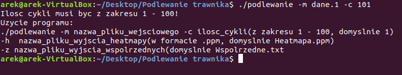
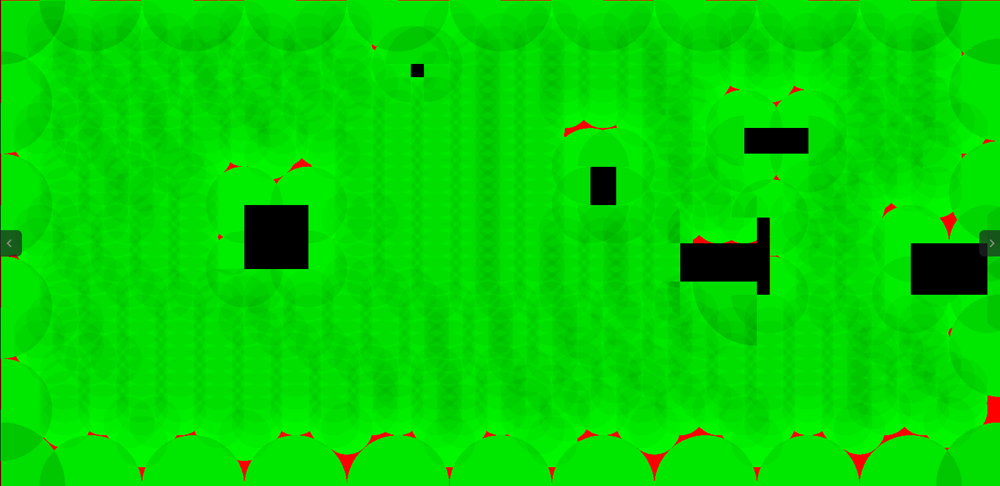

## Table of contents
* [General info](#general-info)
* [Technologies](#technologies)
* [Setup](#setup)
* [Screenshots](#screenshots)

## General info
Project's main goal it to optimize the placement of sprinklers on given map of the lawn. 
	
## Technologies
Project is created with:
* C 
	
## Setup
To run this project, install it locally using npm:

```
$ cd ../Watering-the-lawn-in-C\
$ make\
$ ./podlewanie -m data -c amountOfCycles\
```

## Screenshots
### An example of how to start the program (with an error message)


### An example sprinkler placement generated by the program

